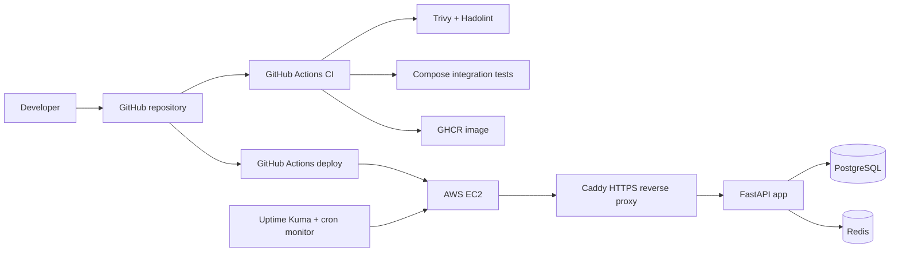
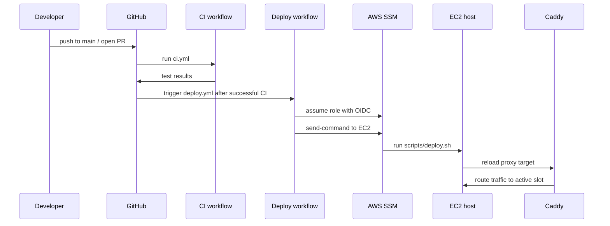

# StatusPulse

StatusPulse is a FastAPI uptime and incident tracking app with a full Docker, GitHub Actions, AWS, monitoring, backup, and security workflow.

## Repository Layout

The root structure now matches the final assessment layout:

- `.github/workflows/ci.yml`
- `.github/workflows/deploy.yml`
- `app/main.py`
- `app/requirements.txt`
- `caddy/Caddyfile`
- `scripts/deploy.sh`
- `scripts/backup.sh`
- `scripts/health-monitor.sh`
- `terraform/main.tf`
- `terraform/variables.tf`
- `terraform/README.md`
- `tests/test_integration.sh`
- `Dockerfile`
- `docker-compose.yml`
- `Makefile`
- `.env.example`
- `.dockerignore`
- `.gitignore`
- `README.md`
- `SECURITY.md`

## Architecture



## What Each Part Does

- `app/`
  - FastAPI app with health checks, services, incidents, and rate limiting.
- `docker-compose.yml`
  - Local stack and production profiles for app, database, Redis, blue-green slots, Caddy, and Uptime Kuma.
- `caddy/Caddyfile`
  - HTTPS termination, security headers, and reverse proxying.
- `scripts/`
  - Blue-green deploy, database backup, and host-side health monitoring.
- `terraform/`
  - AWS EC2, Elastic IP, security group, SSM-enabled instance profile, and GitHub Actions OIDC role.
- `tests/`
  - Integration test script used by CI.
- `.github/workflows/`
  - CI lint/test/scan workflow and deploy workflow.

## GitHub Actions, In Plain English

GitHub Actions is GitHub's built-in automation system. You put YAML files in `.github/workflows/`, and GitHub runs the steps for you on its own machines.

This repository uses two workflows:

- `ci.yml`
  - Runs on pull requests and pushes to `main`.
  - Lints the Python code.
  - Scans the repo and Docker image with Trivy.
  - Builds the Docker image.
  - Starts the local stack with Docker Compose.
  - Runs the integration test script.
- `deploy.yml`
  - Runs only after `ci.yml` finishes successfully on `main`.
  - Builds and pushes the image to GHCR.
  - Uses AWS OIDC, so no long-lived AWS access key lives in GitHub.
  - Finds the EC2 instance created by Terraform.
  - Uses AWS Systems Manager to run the deploy script on that EC2 host.
  - Verifies the public `https://ak-info.online/health` endpoint after deployment.

Think of it like this:

1. You push code to GitHub.
2. GitHub Actions tests it.
3. If the tests pass, GitHub Actions deploys it to AWS.

## AWS, In Plain English

Terraform creates the cloud side of the project:

- One EC2 instance in `us-east-1`
- One Elastic IP
- One security group that only exposes ports 80 and 443
- One IAM role for the EC2 host so Systems Manager can manage it
- One IAM role for GitHub Actions so the workflow can talk to AWS without storing AWS keys in GitHub

On the EC2 instance, the user-data bootstrap script:

- installs Docker, the Compose plugin, Git, AWS CLI, and the SSM agent
- clones this repository into `/opt/statuspulse`
- writes `/opt/statuspulse/.env`
- creates log and backup folders
- installs cron jobs for health checks and backups

The public request path is:

`Internet -> ak-info.online -> Caddy -> active app slot -> PostgreSQL + Redis`

The deploy path is:

`GitHub push -> CI -> GHCR image -> AWS SSM -> EC2 deploy script -> blue/green switch -> health check`

## Local Development

1. Create the environment file:

```bash
cp .env.example .env
```

2. Start the local stack:

```bash
make up
```

3. Verify the API:

```bash
curl http://localhost:8000/health
```

4. Run the integration test:

```bash
make test
```

5. Stop the stack:

```bash
make down
```

### One-Command Bootstrap

If you want the project to prepare itself, run:

```bash
make bootstrap
```

That command:

- creates `.env` from `.env.example` if it does not exist
- checks the Python syntax
- checks the shell scripts
- validates the Docker Compose file
- reminds you to initialize Terraform

## First-Time Deployment

Use this order the first time:

1. Confirm the repository slug is `ManojSelf/statuspulse`.
2. Log in to AWS locally so Terraform can create resources.
3. Run `make bootstrap`.
4. Go to `terraform/` and run:

```bash
terraform init
terraform apply
```

5. Copy the `elastic_ip` output.
6. Point the DNS `A` record for `ak-info.online` to that Elastic IP.
7. Push a commit to `main` or use `workflow_dispatch` in GitHub Actions.
8. Watch the `CI` workflow finish.
9. Watch the `Deploy` workflow start automatically after CI succeeds.

## Required GitHub Setup

You do not need AWS access keys in GitHub because the workflow uses AWS OIDC.

What you do need:

- The repository must allow GitHub Actions to run.
- The workflow permissions already in the YAML must stay enabled:
  - `contents: read`
  - `id-token: write`
  - `packages: write`
- Optional secret:
  - `DEPLOY_NOTIFY_WEBHOOK_URL` if you want success/failure notifications.

If you want to add or change repository secrets later, GitHub stores them under:

`Settings -> Secrets and variables -> Actions`

## AWS Deployment

The production deployment uses:

- GitHub Actions for CI/CD
- GHCR for container images
- AWS EC2 for the runtime
- Caddy for HTTPS with Let’s Encrypt
- AWS Systems Manager for remote execution

### What Happens During CI

When you open a pull request or push to `main`, `ci.yml` does the following:

1. Checks out the code.
2. Installs Python tooling.
3. Runs `ruff` to lint the app and tests.
4. Runs Trivy filesystem scans for vulnerabilities and secrets.
5. Runs `hadolint` against the Dockerfile.
6. Builds the Docker image.
7. Scans the built image with Trivy.
8. Starts PostgreSQL, Redis, and the app with Docker Compose.
9. Waits for `/health` to report healthy.
10. Runs `tests/test_integration.sh`.

If anything fails, the workflow stops and the deployment does not happen.

### What Happens During Deploy

When CI succeeds on `main`, `deploy.yml` does the following:

1. Checks out the exact commit that passed CI.
2. Logs in to GHCR using the workflow token.
3. Builds and pushes the image tags for the commit SHA and `latest`.
4. Assumes the AWS role through OIDC.
5. Finds the EC2 instance tagged `Name=statuspulse`.
6. Sends a Systems Manager `SendCommand` request to that EC2 instance.
7. The EC2 host runs `scripts/deploy.sh`.
8. The deploy script starts the candidate blue/green slot.
9. If the candidate passes health checks, Caddy is pointed at it.
10. If the public health check fails, the script rolls back.

### How the Blue/Green Deploy Works

This app keeps two production app containers:

- `app_blue`
- `app_green`

Only one slot is active at a time. The deploy script:

1. Detects the current active slot from `.env`.
2. Pulls the new image for the inactive slot.
3. Starts the inactive slot.
4. Checks the new slot's `/health` endpoint from inside the host.
5. Switches `APP_UPSTREAM_HOST` to the new slot.
6. Reloads Caddy.
7. Checks the public HTTPS health endpoint.
8. Stops the old slot after the new one is confirmed healthy.

This gives you a simple rollback path if the new release misbehaves.

### Provision the infrastructure

```bash
cd terraform
terraform init
terraform apply
```

Then:

1. Take the `elastic_ip` output.
2. Point `ak-info.online` to that Elastic IP with an `A` record.
3. The Terraform defaults already target `ManojSelf/statuspulse`.
4. The GitHub Actions workflow uses GHCR and AWS OIDC automatically.

### GitHub Actions Flow Diagram



## Monitoring

Start Uptime Kuma with:

```bash
docker compose --profile monitoring up -d uptime-kuma
```

The EC2 host bootstrap also installs cron jobs for:

- `scripts/health-monitor.sh` every 5 minutes
- `scripts/backup.sh` every day at 03:00 UTC

Create monitors for:

- `PUBLIC_HEALTH_URL`
- TLS certificate expiry
- PostgreSQL and Redis if you want direct probes

Recommended notification channels:

- Email
- Slack
- Discord
- Telegram

## Backup

Run a database backup on the server with:

```bash
./scripts/backup.sh
```

Backups are written to `BACKUP_DIR` and optional S3 upload is supported when `S3_BACKUP_BUCKET` is set.
The Terraform bootstrap also schedules the backup script through cron.

## Security

- The app rate limits requests in-process.
- Caddy adds security headers and terminates TLS.
- CI scans the repository and built image with Trivy.
- Secrets stay out of git and live in `.env` or GitHub Actions secrets.

## Troubleshooting

If a deployment fails:

1. Open the `Actions` tab in GitHub.
2. Read the `CI` workflow logs first.
3. If CI passed but deploy failed, read the `Deploy` workflow logs.
4. Check the AWS Systems Manager command output for the EC2 host.
5. On the server, inspect:

```bash
docker compose ps
docker compose logs -f caddy app_blue app_green db redis
```

If the site is down after a release, the deploy script should already have rolled back to the previous slot.

## Helpful References

- [GitHub Actions secrets](https://docs.github.com/en/actions/concepts/security/about-secrets)
- [Using secrets in GitHub Actions](https://docs.github.com/en/actions/how-tos/write-workflows/choose-what-workflows-do/use-secrets)
- [`workflow_run` event](https://docs.github.com/en/actions/reference/workflows-and-actions/events-that-trigger-workflows)
- [GitHub OIDC in AWS](https://docs.github.com/en/actions/deployment/security-hardening-your-deployments/configuring-openid-connect-in-amazon-web-services)
- [GitHub Container Registry](https://docs.github.com/packages/getting-started-with-github-container-registry/about-github-container-registry)
- [AWS Systems Manager SendCommand](https://docs.aws.amazon.com/systems-manager/latest/APIReference/API_SendCommand.html)

## Useful Commands

```bash
make build
make up
make up-prod
make monitor
make test
make logs
make clean
```
